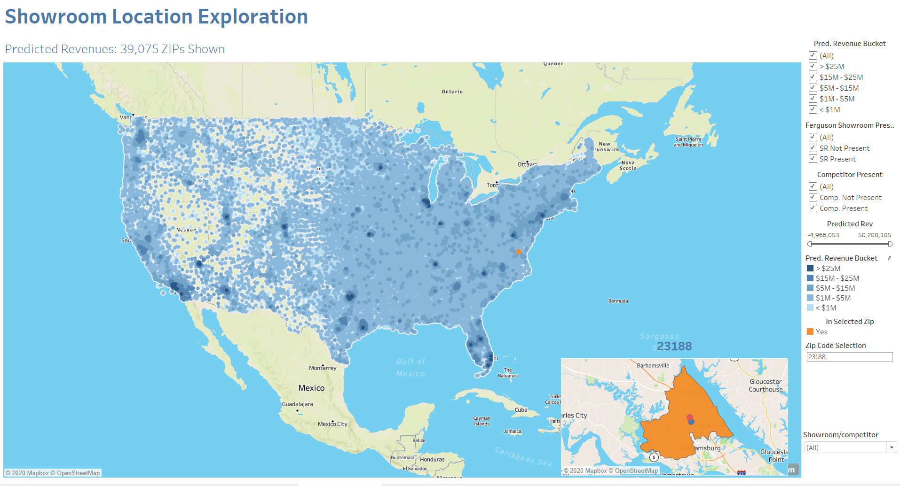

## Ferguson Showroom Location Selection

Ferguson has many different kinds of locations, with one of the most important being their customer-facing showrooms, which sell bath, kitchen, and lighting products. Despite the importance of these showrooms for generating revenue, the selection of locations for the showrooms has been somewhat arbitrary in the past.
Our task in this project was to produce a tool for assisting in selecting promising showroom locations based on predicted revenue for these locations output from a model that we created.


### View Tableau Visualizations
[Showrooms in Tableau](https://public.tableau.com/profile/zhongyi1091#!/vizhome/Ferguson_Tool_final/ShowroomSelection?publish=yes)



### Gradient Boost Model 

```markdown
#Load Library
rm(list=ls())
library(dplyr)
# install.packages("ggcorrplot")
library(ggcorrplot)
set.seed(1)
#MASTER DATASET
masterData <- read.csv("MASTER.csv", header=T)
#new column
masterData$X2016.Population.in.Group.Quarters.Rate <- (masterData$X2016.Population.in.Group.Quarters / masterData$X2016.Total.Population) * 100
#Select columns
masterDataSubset <- masterData %>% select(Showroom.Demand,Permits, est...constr.bus, 
                                          X2016.Population.in.Group.Quarters,
                                          X2016.Population.Density,
                                          Avg_AGI_per_return, 
                                          competitor.count,revenue)
sum(is.na(masterDataSubset)) #81512
sapply(masterDataSubset, function(x) sum(is.na(x)))
masterDataSubset[is.na(masterDataSubset)] <- 0
sum(is.na(masterDataSubset)) #0
#subset on only ferguson showroom
ferguson = filter(masterData, !is.na(masterData$revenue) | masterData$revenue != "")
summary(ferguson)
ferguson_subset= ferguson %>% select(Showroom.Demand,Permits, est...constr.bus, 
                                     X2016.Population.in.Group.Quarters,
                                     X2016.Population.Density,
                                     Avg_AGI_per_return, 
                                     competitor.count,revenue)
sum(is.na(ferguson_subset)) #5
#X2016.Population.in.Families ->1, Avg_AGI_per_return ->2
ferguson_subset[is.na(ferguson_subset)] <- 0
#correlation
corr <- round(cor(ferguson_subset), 3) 
#Train&Validate
n <- nrow(ferguson_subset)
trainprop = 0.8
train  <-  sample(n, trainprop * n)
validate  <-  sample(setdiff(1:n, train)) 
trainset <- ferguson_subset[train,]
validateset <- ferguson_subset[validate,]
#gbm
library(gbm)
gbmMod <- gbm(revenue~.,data=trainset,distribution="gaussian",n.trees=5000,interaction.depth=4)
summary(gbmMod)
yhat.boost <- predict(gbmMod,newdata=validateset,n.trees=5000)
gbmMSE=mean((yhat.boost-validateset$revenue)^2)
gbmMSE
#prediction
masterDataSubset$predicted_rev <- predict(gbmMod,newdata=masterDataSubset,n.trees=5000)
boosting_predictions <- masterDataSubset
summary(boosting_predictions)
#save file 
write.csv(boosting_predictions, 'boosting_predictions_with_rate.csv',row.names = F)

```


